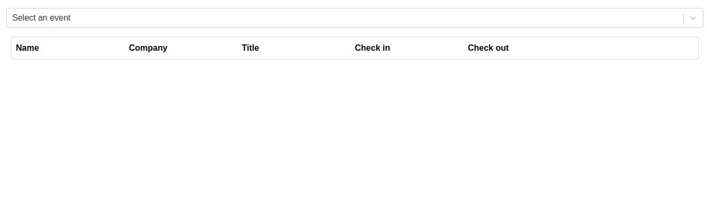
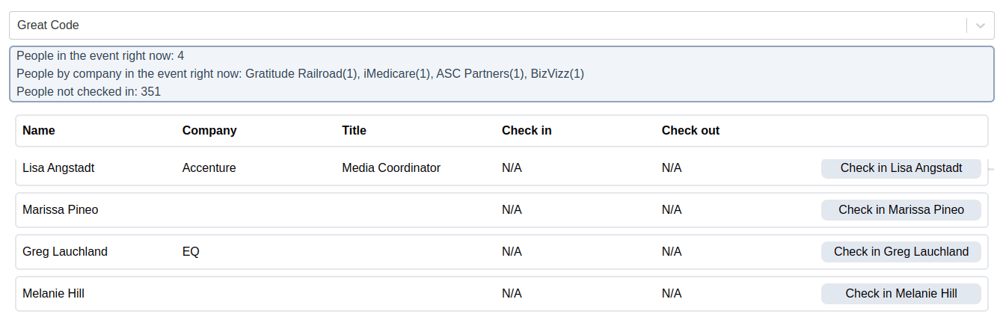

 

 

Este projeto foi realizado como um desafio para um processo seletivo.
O desafio era descrito da seguinte maneira:

 

>What you need to deliver
A mini-application that allows event hosts to check people into an event.

>The home page should show:

>- an event selector (`select`) displaying the name of each event, by default displaying `Select an event` (communities collection);
>- a list of people registered in the selected event (people collection).

>The list of people should allow the event host to:

>- see first and last name together (full name), company name, title, check-in date, and check-out date both using `MM/DD/YYYY, HH:mm` format or `N/A`;
>- check people into the event by clicking the "Check-in {person firstName and lastName}" button;
>- if the user was checked-in over five seconds ago, we want to see a "Check-out {person firstName and lastName}" check-out button.

>Between the event selector and the list of people we want to see a summary like this:

>- `People in the event right now: 10`;
>- `People by company in the event right now: Green Group (10), Hoppe Group (5)`;
>- `People not checked-in: 200`;

>The page needs to be reactive -- no refresh should be needed to display the latest data.

Exemplo selecionando um evento:

Exemplo efetuando check-in, mostrando o resumo mudando de acordo, e o botão de check-out aparecendo 5 segundos após o check-in:

